== Documentation of Someip

=== **Index**
      
toc::[]

xref:vsomeIP-Overview[1.vsomeIP Overview]

xref:Prerequisites[2. Prerequisites]
 
xref:Docker-Installation[2.1.Docker Installation]

xref:Kubernetes-Installation[2.2.Kubernetes Installation]

xref:Installation-and-Upgrade[3. Installation and Upgrade]

xref:Configuration[4. Configuration]

xref:TCP[4.1.TCP]

xref:UDP[4.2.UDP]

xref:Shared-Memory[4.3. Shared Memory]

xref:Communication-styles[5. Communication styles]

xref:Applications-running-in-same-containers[5.1 Applications running in same containers]

xref:Applications-running-in-different-containers-in-a-same-Pod[5.2 Applications running in different containers, in a same Pod]

xref:Applications-running-in-different-Pod-in-a-same-Node[5.3 Applications running in different Pod, in a same Node]

xref:Applications-running-in-different-Nodes[5.4 Applications running in different Nodes]

xref:CI-CD-process[6. CI/CD process]

<<<

[[vsomeIP-Overview]]

**1.vSomeIP Overview:**

vSomeIP (Virtualized Scalable Service-Oriented MiddlewarE over IP) is an implementation of the SOME/IP protocol, which is a communication protocol used in automotive and other embedded systems for service-oriented communication over IP networks. vSomeIP enables inter-process communication between software components in a distributed system. It provides features like message serialization, service discovery, and end-to-end (E2E) protection.

[[Prerequisites]]

*2.Prerequisites:*

Make sure you have installed docker and Kubernetes on the local system.

[[Docker-Installation]]

*2.1 Docker Installation:*

Docker provides installation guides for various operating systems on their official website. You can find the appropriate installation guide for your OS here 

:docker-desktop-install-url: https://docs.docker.com/desktop/install/windows-install/

You can find the Docker Desktop installation instructions for Windows link:{docker-desktop-install-url}[here].

Follow the instructions provided in the Docker installation guide for your specific operating system, and it will walk you through the installation process.

[[Kubernetes-Installation]]

*2.2 Kubernetes Installation:*

Kubernetes provides installation guides for various operating systems on their official website. You can find the appropriate installation guide for your OS here 

:kubernetes-install-url: https://kubernetes.io/docs/tasks/tools/install-kubectl-windows/

You can find the Kubernetes installation instructions for Windows link:{kubernetes-install-url}[here].

Follow the instructions provided in the Kubernetes installation guide for your specific operating system, and it will walk you through the installation process.

<<<

[[Installation-and-Upgrade]]

*3.Installation and Upgrade:*

Step 1: Pull the image from the Azure Container Registry (ACR)
To pull the Docker image from the ACR, you use the *docker pull* command followed by the image name and tag/version:
			   
    docker pull scutiregistry.azurecr.io/someip_example:version

Replace *someip_example* with the name of the image and *version* with the specific version or tag you want to pull from the registry.

Step 2: Add the image in the YAML file
	   
In this step, you are adding the pulled image to a Kubernetes YAML file, where you specify the image in the *spec* section of a container definition. Here's an example of how you can do that:
		
	apiVersion: v1
	kind: Pod
	metadata:
	  name: vsomeip-notify
	spec:
	  containers:
	  - name: someip-example-container
		image: scutiregistry.azurecr.io/someip-example:v1.0.1190-scuti
		command: ["sh", "/start-notify-udp.sh"]

In this example, we define a Kubernetes Pod that runs a single container with the image *scutiregistry.azurecr.io/someip-example:v1.0.1190-scuti*. We also specify the command to run inside the container using the *command* field.
				
Step 3: Run the YAML file
		
To deploy the YAML file and create the specified Pod with the container, you use the *kubectl apply* command:
		   
		     kubectl apply -f file-name.yaml
			 
Replace *file-name.yaml* with the actual name of your YAML file.

After running this command, Kubernetes will create the necessary resources based on the YAML file you provided, including the Pod with the specified container.
		
     pod/vsomeip-notify created
     pod/vsomeip-subscriber created
	 
<<<

[[Configuration]]
				
*4.Configuration:*

[[TCP]]

*4.1 TCP* 

[[UDP]]
   
*4.2 UDP*

[[Shared-Memory]]
   
*4.3 Shared Memory*

<<<

[[Communication-styles]]

*5.Communication styles:*

[[Applications-running-in-same-containers]]
      
*5.1 Applications running in same containers :*

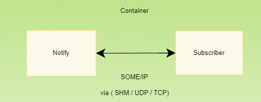

* *Container*: Represents a single container that includes both the "Notifier" and "Subscriber" applications running together.

* *Applications*: The container contains two applications: the *"Notifier"* application and the *"Subscriber"* application.

* *Notifier*: Represents the "Notifier" application that generates events or notifications.
 
* *Subscriber*: Represents the "Subscriber" application that listens for and processes the events or notifications sent by the "Notifier."

* In this scenario, both the "Notifier" and "Subscriber" applications communicate smoothly and exchange information through the SOME/IP protocol inside the container, without needing any external networks or devices
        
<<<

[[Applications-running-in-different-containers-in-a-same-Pod]]

*5.2 Applications running in different containers, in a same Pod:* 

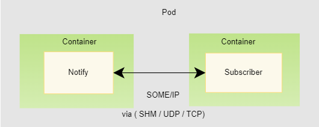

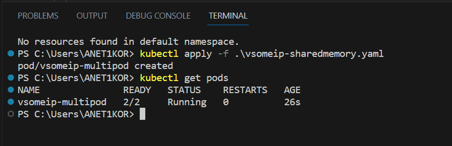
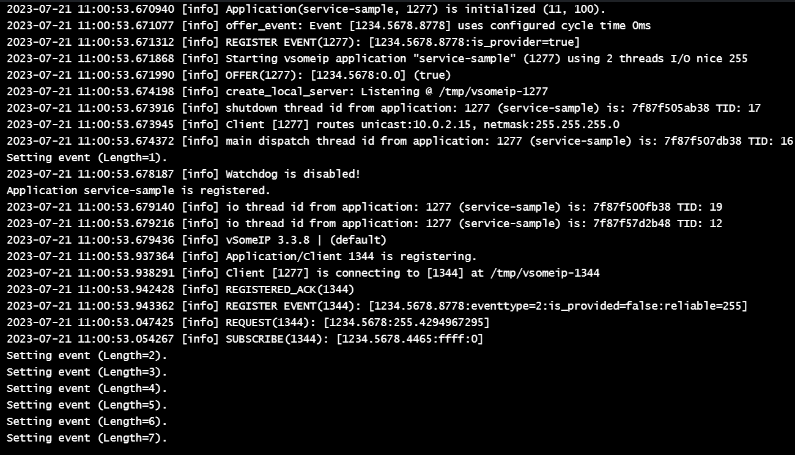
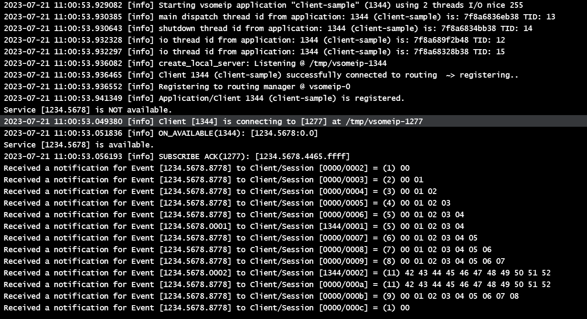

* In this scenario, The pod contains two containers: "Container 1" (Notify) and "Container 2" (Subscriber).
 
* The *"Notifier"* container (Container 1) is responsible for publishing events or notifications using the SOME/IP protocol. It encodes the event data into SOME/IP messages and sends them out.

* On the other hand, the *"Subscriber"* container (Container 2) is responsible for subscribing to these events through the SAME/IP protocol. It receives the SOME/IP messages sent by the "Notifier," decodes them to extract the event data, and processes the events accordingly. 

* Both the *"Notifier"* and *"Subscriber"* containers are co-located within the same pod, which means they share the same network namespace. This allows them to effectively communicate with each other using the "localhost" network interface. The shared network namespace enables seamless and efficient communication between the containers, facilitating the exchange of SOME/IP messages for the publish-subscribe pattern to work effectively within the Kubernetes pod.

<<<

[[Applications-running-in-different-Pod-in-a-same-Node]]

*5.3 Applications running in different Pod, in a same Node :* 

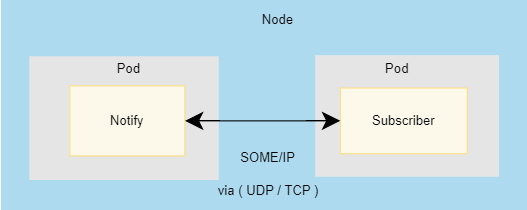

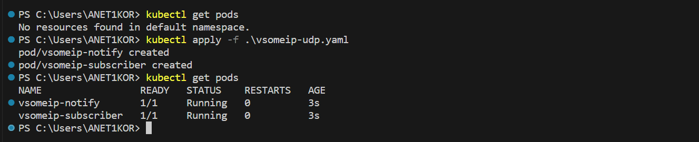
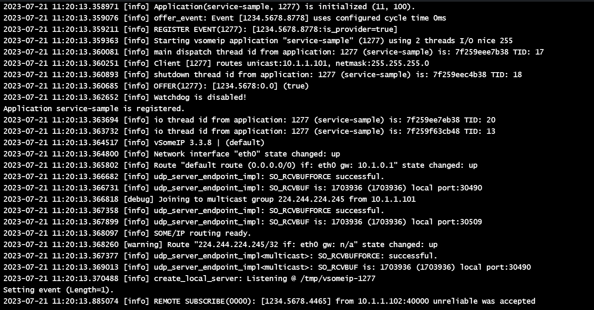
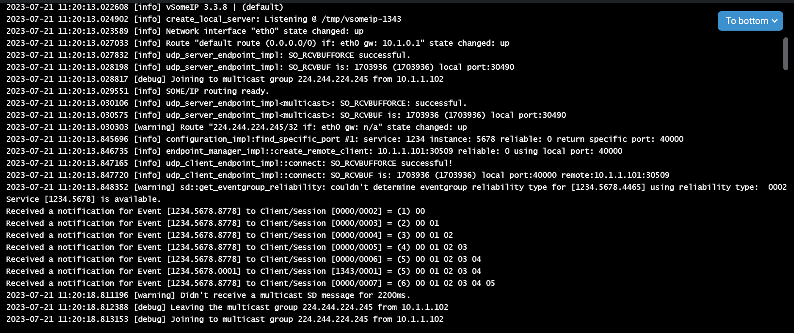

* In this scenario, We have two pods running on the same node: one pod acts as the "Notifier" and the other as the "Subscriber," both communicating via the SOME/IP protocol     Kubernetes Node: Represents a physical or virtual machine in the Kubernetes cluster where the two pods are scheduled to run.

* *Pod 1 (Notify)*: The first pod contains the "Notifier" container responsible for publishing events or notifications.

* *Notifier Container*: The "Notifier" container runs within Pod 1 and communicates using the SOME/IP protocol. It generates events and formats them into SOME/IP messages for transmission.

* *Pod 2 (Subscribe)*: The second pod contains the "Subscriber" container responsible for subscribing to and processing events.

* *Subscriber Container*: The "Subscriber" container runs within Pod 2 and communicates using the SOME/IP protocol. It listens for incoming SOME/IP messages from the "Notifier" container.

* *Communication via SOME/IP*: The "Notifier" container in Pod 1 sends SOME/IP messages containing events to the "Subscriber" container in Pod 2 over the node's internal network.

* *Node*: Since both pods are scheduled on the same node, they can communicate directly using the node's internal network without involving external network hops. This allows for low-latency communication between the "Notifier" and "Subscriber" containers.

* The communication flow between the "Notifier" and "Subscriber" containers running in different pods on the same Kubernetes node. The SOME/IP protocol facilitates efficient communication between the two containers for event notification and processing.

<<<

[[Applications-running-in-different-Nodes]]

*5.4 Applications running in different Nodes:* 

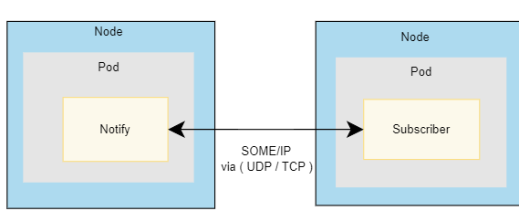

* In this scenario, the "Notifier" and "Subscriber" applications are running in different pods, and these pods are scheduled on different nodes within a Kubernetes cluster. They communicate with each other via the SOME/IP protocol.

* *Kubernetes Cluster*: Represents the entire Kubernetes environment, consisting of multiple nodes that can be physical or virtual machines.

* *Node 1 (Pod 1)*: Represents one of the nodes within the Kubernetes cluster. This node hosts "Pod 1."

* *Pod 1*: Contains the "Notifier" application, which generates events and communicates via the SOME/IP protocol.

* *Notifier*: The "Notifier" application runs inside "Pod 1" on "Node 1." It generates events and sends SOME/IP messages.

* *Node 2 (Pod 2)*: Represents another node within the Kubernetes cluster. This node hosts "Pod 2."

* *Pod 2*: Contains the "Subscriber" application, which listens for events and communicates via the SOME/IP protocol.

* *Subscriber*: The "Subscriber" application runs inside "Pod 2" on "Node 2." It receives SOME/IP messages and processes events accordingly.

* *Communication via SOME/IP*: The "Notifier" application sends SOME/IP messages with events to the "Subscriber" application. These messages travel over the network connecting "Node 1" and "Node 2" within the Kubernetes cluster.

* *Different Nodes and Pods*: Since "Notifier" and "Subscriber" are running in different pods on different nodes, they communicate through the Kubernetes network and the underlying network infrastructure that connects the nodes in the cluster. The SOME/IP protocol enables them to exchange data effectively despite being deployed on separate nodes.

<<<

[[CI-CD-process]]

*6.CI/CD process*

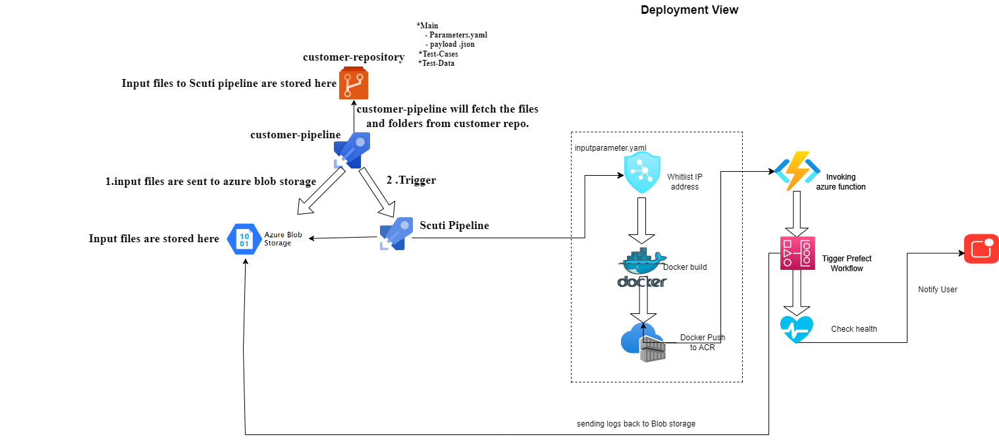

* *Customer Pipeline Steps:*

* Read parameters.yaml: The customer pipeline reads the parameters.yaml file from the main folder in the repository. This file contains essential information provided by the customer, such as the image name, repository name, and deployment tag.

* Upload Folders to Azure Blob Storage: Based on the customer's choice specified in parameters.yaml, the customer pipeline uploads the selected folders (main, test-cases, and test-data) to their respective containers (main, test-cases, and test-data) in Azure Blob Storage.

* *Triggering the Scuti-Pipeline:*

* Scuti Pipeline Execution: After being triggered by the customer pipeline, the Scuti-Pipeline starts its execution.

* *Scuti Pipeline Steps:*

* Read parameters.yaml from Azure Blob Storage: The Scuti pipeline accesses Azure Blob Storage and retrieves the parameters.yaml file from the appropriate container (main).

* Extract Image Name, Deployment Tag, and Repository Name: The Scuti pipeline parses the content of parameters.yaml to extract the necessary information, such as the image name, deployment tag, and repository name. This extracted data will be used for the next steps.

* Build the Docker Image: Using the extracted image name, deployment tag, and repository name, the Scuti pipeline initiates the building of the Docker image. It references the payload.json file and any other required dependencies to create a custom Docker image.

* Push the Image to Azure Container Registry (ACR): Once the Docker image is built, the Scuti pipeline pushes the image to the specified Azure Container Registry. This step makes the custom Docker image available for deployment and use in various environments.

* Pipeline Template Repository: The pipeline_template repository contains the configuration and scripts required for the Scuti pipeline. It acts as a blueprint for setting up and running the pipeline effectively.

